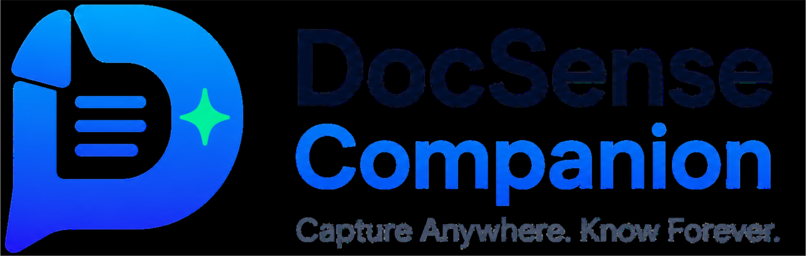

<div align="center">
  

  <h1 style="margin-top: 20px;">DocSense Companion</h1>

  <p>
    <strong>The intelligent browser extension that bridges the gap between your web browsing and the DocSense AI backend.</strong>
  </p>

  <p>
    <a href="https://github.com/Ramkrishna45/DocSense-Companion/stargazers"></a>
    <a href="https://github.com/Ramkrishna45/DocSense-Companion/network/members"></a>
    <a href="https://github.com/Ramkrishna45/DocSense-Companion/issues"></a>
    
    
    
  </p>
</div>

<br />

> **DocSense Companion** acts as a seamless bridge to your [DocSense AI](https://github.com/Ramkrishna45/DocSense-AI) dashboard. Designed to enhance your research and reading workflows, this Chrome extension allows you to instantly capture web pages, select text excerpts, and save them directly into your secure knowledge base. Once saved, your documents are instantly ready for querying and semantic searching via the power of DocSense AI.

## ✨ Key Features

- 📑 **Full Page Capture**: Don't lose valuable articles or documentation. Instantly save the main content of any web page. The extension automatically extracts the readable text, stripping out ads, sidebars, and clutter for a pristine reading experience.
- ✂️ **Smart Selection Capture**: Highlight specific paragraphs, code blocks, or sentences on a page. A quick-save floating button instantly appears, allowing you to save only what matters.
- 🤖 **AI Semantic Search**: Search through your saved documents directly from the browser extension popup. Powered by vector embeddings, the search understands the *meaning* of your query, not just exact keyword matches.
- 🗂️ **Seamless Collection Management**: Choose exactly which DocSense AI collection you want to save your captured documents to without ever leaving the webpage. Organize your research on the fly.
- 🖱️ **Floating UI Assistant**: A subtle, non-intrusive floating button appears dynamically on web pages to quickly trigger actions and saves, ensuring your flow isn't interrupted.
- 🎨 **Modern Light UI**: A sleek, beautifully crafted, glassmorphic interface designed for high legibility, immediate responsiveness, and an exceptional user experience.

<br />

## 📖 How It Works

DocSense Companion operates through a combination of a persistent background service worker and content scripts injected into the pages you visit:

1. **Authentication:** Log in via the popup to establish a secure connection with your DocSense AI account.
2. **Data Extraction:** When triggered, the content script analyzes the DOM of the active tab to extract the main content using readability algorithms.
3. **Transmission:** The clean text is sent to the DocSense AI backend where it is immediately embedded and added to your selected collection.

<br />

## 🚀 Installation & Setup (Developer Mode)

To try out the extension locally or modify its behavior, follow these steps to load it into Chrome.

### Prerequisites
- [Node.js](https://nodejs.org/) (v16 or higher recommended)
- [Git](https://git-scm.com/)
- Google Chrome Browser

### Step-by-Step Guide

1. **Clone the repository**
   ```bash
   git clone https://github.com/Ramkrishna45/DocSense-Companion.git
   cd DocSense-Companion
   ```

2. **Install dependencies**
   ```bash
   npm install
   ```

3. **Build the extension**
   ```bash
   npm run build
   ```
   *This command leverages Vite to generate a fully compiled `dist` folder optimized for Manifest V3.*

4. **Load the Extension into Chrome**
   - Open Google Chrome and navigate to the extensions page: `chrome://extensions/`
   - Enable **Developer mode** using the toggle switch in the top right corner.
   - Click the **Load unpacked** button in the top left.
   - Select the `dist` folder that was generated in Step 3.

<br />

## 🎯 Usage Guide

Once installed, getting started is simple:

1. **Pin the Extension**: Click the puzzle piece icon in Chrome and pin the DocSense logo to your toolbar for easy access.
2. **Log In**: Click the extension icon and log in with your DocSense AI credentials.
3. **Save a Full Page**: While on any article, open the extension and click "Save Page". Select your desired collection from the dropdown.
4. **Save a Snippet**: Highlight any text on a webpage. A small DocSense floating icon will appear near your cursor. Click it to instantly save just that text snippet.
5. **Quick Search**: Open the extension and use the search bar at the top to semantically query your entire DocSense AI knowledge base.

<br />

## 🛠️ Technology Stack

Built with a modern web development stack tailored for robust Chrome Extension development:

* **Framework:** React 18
* **Build Tool:** Vite (with custom Rollup configuration tailored for Manifest V3 architecture)
* **Styling:** Tailwind CSS (v4) for utility-first styling
* **Language:** TypeScript for type-safe code
* **Icons:** SVG assets & Lucide React

<br />

## 📁 Project Structure

The codebase is organized cleanly to separate popup UI logic from background extension services:

```text
src/
├── background/    # Service worker (handles API comms, alarms, state management)
├── components/    # Reusable React components (LoginForm, SettingsPanel, QuickSearch)
├── content/       # Content scripts injected into active web pages (floating UI, extraction)
├── hooks/         # Custom React hooks (e.g., useSearch, useAuth)
├── popup/         # Main React application entry for the extension popup UI
├── services/      # API client definitions and local Chrome storage wrappers
├── types/         # Global TypeScript interface definitions
└── utils/         # Constants, metadata extractors, and helper functions
```

<br />

## 🤝 Contributing

Contributions make the open-source community an amazing place to learn, inspire, and create. Any contributions you make are **greatly appreciated**.

If you have a suggestion that would make this better, please fork the repo and create a pull request. You can also simply open an issue with the tag "enhancement".

1. Fork the Project
2. Create your Feature Branch (`git checkout -b feature/AmazingFeature`)
3. Commit your Changes (`git commit -m 'Add some AmazingFeature'`)
4. Push to the Branch (`git push origin feature/AmazingFeature`)
5. Open a Pull Request

<br />

## 📄 License

Distributed under the MIT License. See `LICENSE` for more information.
