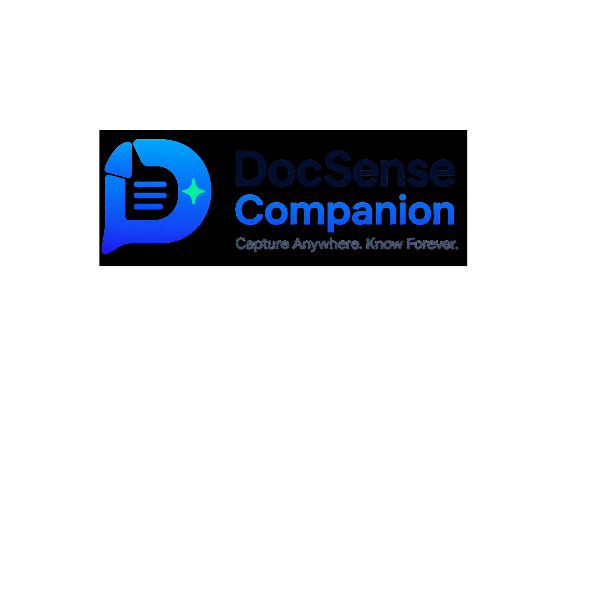

<div align="center">
  

  <h1 style="margin-top: 20px;">DocSense Companion</h1>

  <p>
    <strong>The intelligent browser extension that bridges the gap between your web browsing and the DocSense AI backend.</strong>
  </p>

  <p>
    <a href="https://github.com/Ramkrishna45/DocSense-Companion/stargazers"></a>
    <a href="https://github.com/Ramkrishna45/DocSense-Companion/network/members"></a>
    <a href="https://github.com/Ramkrishna45/DocSense-Companion/issues"></a>
    
    
    
  </p>
</div>

<br />

> **DocSense Companion** acts as a seamless bridge to your [DocSense AI](https://github.com/Ramkrishna45/DocSense-AI) dashboard. It allows you to instantly capture web pages, select text excerpts, and save them directly into your knowledge base for later searching, reading, and querying via AI.

## ✨ Key Features

- 📑 **Full Page Capture**: Instantly save the main content of any article, blog post, or documentation page. The extension automatically extracts the readable text and intelligently strips out clutter.
- ✂️ **Selection Capture**: Highlight specific paragraphs or sentences on a page, and a quick-save floating button will appear. Save only what matters.
- 🤖 **AI Semantic Search**: Search through your saved documents instantly right from the browser extension popup, powered by semantic understanding, not just exact keywords.
- 🗂️ **Collection Management**: Choose exactly which DocSense AI collection you want to save your captured documents to directly from the extension UI.
- 🖱️ **Floating UI Assistant**: A subtle, non-intrusive floating button appears on web pages to quickly trigger captures without leaving your current context.
- 🎨 **Modern Light UI**: A sleek, beautifully crafted, glassmorphic light-mode interface designed for high legibility and an exceptional user experience.

<br />

## 🛠️ Technology Stack

Built with a modern web development stack tailored for robust Chrome Extension development:

* **Framework:** React 18
* **Build Tool:** Vite (with custom Rollup configuration tailored for Manifest V3)
* **Styling:** Tailwind CSS (v4)
* **Language:** TypeScript
* **Icons:** SVG assets & Lucide React

<br />

## 🚀 Installation (Developer Mode)

To try out the extension locally or modify its behavior:

1. **Clone the repository**
   ```bash
   git clone https://github.com/Ramkrishna45/DocSense-Companion.git
   cd DocSense-Companion
   ```

2. **Install dependencies**
   ```bash
   npm install
   ```

3. **Build the extension**
   ```bash
   npm run build
   ```
   *This will generate a `dist` folder containing the fully compiled extension files.*

4. **Load into Chrome**
   - Open Google Chrome and navigate to `chrome://extensions/`
   - Enable **Developer mode** using the toggle switch in the top right corner.
   - Click the **Load unpacked** button in the top left.
   - Select the `dist` folder that was created in step 3.

<br />

## 📁 Project Structure

The codebase is organized cleanly to separate popup logic from background services:

```text
src/
├── background/    # Service worker (handles API comms, context menus, shortcuts)
├── components/    # Reusable React components (Login, Settings, Search, TabBar)
├── content/       # Content scripts injected into active web pages
├── hooks/         # Custom React hooks (e.g., useSearch, useAuth)
├── popup/         # Main React application entry for the extension popup UI
├── services/      # API client and local Chrome storage wrappers
├── types/         # Global TypeScript definitions
└── utils/         # Constants, metadata extractors, and helper functions
```

<br />

## 🤝 Contributing

We welcome contributions! If you'd like to help improve DocSense Companion, please follow these steps:

1. **Fork** the repository
2. Create your feature branch (`git checkout -b feature/AmazingFeature`)
3. Commit your changes (`git commit -m 'Add some AmazingFeature'`)
4. Push to the branch (`git push origin feature/AmazingFeature`)
5. Open a **Pull Request**

<br />

## 📄 License

This project is licensed under the MIT License. See the `LICENSE` file for details.

---
<div align="center">
  <p>Built with ❤️ for <strong>DocSense AI</strong></p>
</div>
